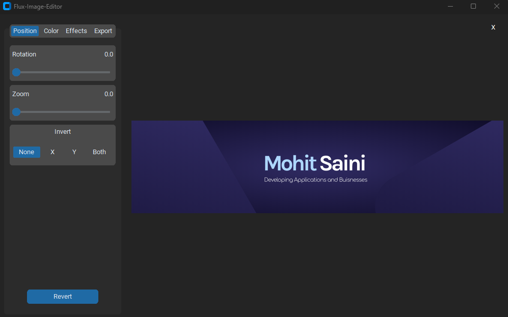

# Flux-Image-Editor 🎨📸

This image editor comes with differnet functionalities including:

1. Add blur and contrast.
2. Implement rotation and zoom.
3. Increase brightness and vibrance.
4. Apply different filter effects, including emboss, find edges, contour, and edge enhance.
5. Provide support for exporting images after making all of these changes.

# Preview

<table>
  <tr >
    

        
    

  </tr>
</table>

<h1 align="center">⚡Connect with me⚡</h1>

   
  	
	
    

